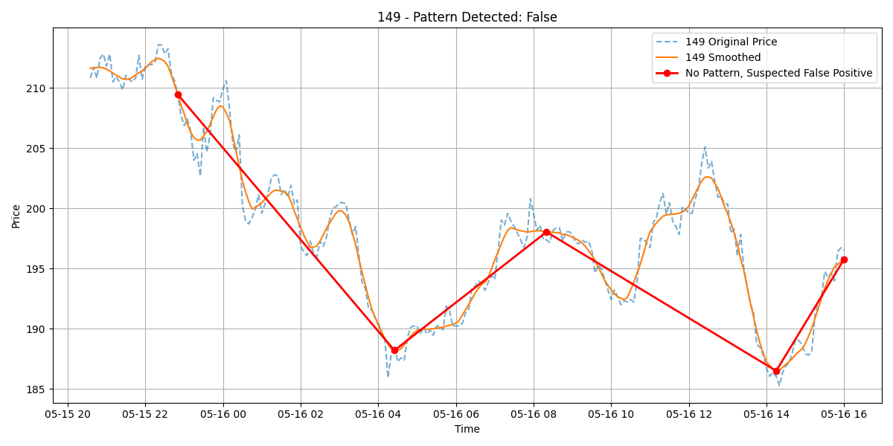
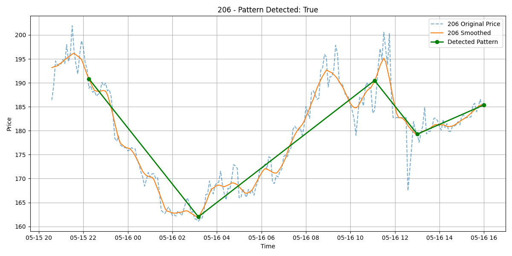
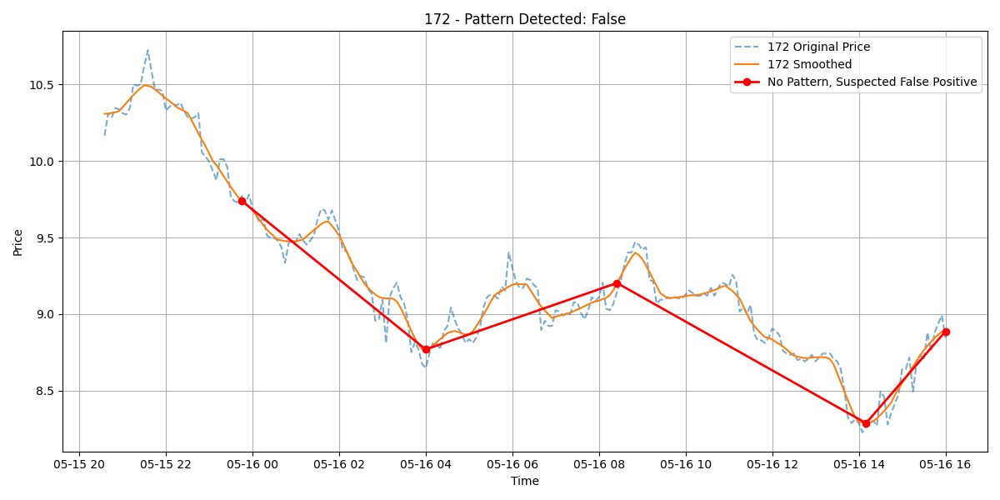
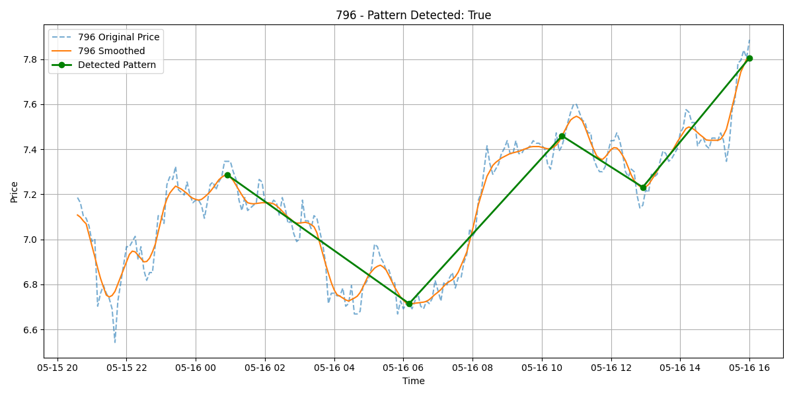

# Stock Pattern Detection POC

# Project Description

This project is a local proof-of-concept (POC) stock tracker and recommendation system. It collects real-time stock prices for seven major companies, stores the data, and analyzes it to detect the classic "cup and handle" technical pattern. The application runs locally, includes an automated scheduler, and exposes an interactive API for pattern detection and debugging.

The README includes full setup instructions, API usage examples, expected responses, troubleshooting tips, and even visual examples of detected patterns.

For any questions, issues, or feedback, please contact Assaf Zimand via GitHub or email - assafzimand@gmail.com

## Requirements

- Python 3.10
- pip 25.1.1

## 🧰 Setup Instructions

### 1. Clone the Repository
```bash
git clone https://github.com/assafzimand/Stock_Tracker.git
cd Stock_Tracker
```

### 2. Create and Activate a Virtual Environment
#### On Windows:
```bash
python -m venv venv
venv\Scripts\activate
```

#### On macOS/Linux:
```bash
python3 -m venv venv
source venv/bin/activate
```

### 3. Install Requirements
```bash
pip install -r requirements.txt
```

### 4. Run the Application
```bash
python main.py
```

This will:
- Start the stock price fetch scheduler (runs every 5 mins during US trading hours)
- Open your browser to the Swagger API docs automatically

---

## 🌐 Using the API

Once the server is running, go to:
```
http://127.0.0.1:8000/docs
```

Use the `/detect-pattern` endpoint to check for a **cup and handle** pattern.

To use this endpoint:
1. Click "Post".
2. Click "Try it out".
3. Adjust the input as you wish within the constraints.
4. Click "Execute".
5. The output will be displayed below.

### Request Body Example:
```json
{
  "company": "Apple",
  "include_plot": true
}
```

> 🔸 `company` must be one of:  
> `Apple`, `Microsoft`, `Alphabet`, `Amazon`, `Nvidia`, `Meta`, `Tesla`

---

### ✅ Successful Response:
```json
{
  "company": "Apple",
  "pattern_detected": true,
  "plot_base64": "iVBORw0KGgoAAAANSUhEUgAA..."
}
```
## 🖼️ How to View the Plot

If `include_plot` is set to `true`, the response will contain a `plot_base64` string.  
This is an image encoded in base64 format (PNG).

### To view it:

#### Option 1: Use an online viewer
1. Copy the `plot_base64` string from the response
2. Go to a site like https://codebeautify.org/base64-to-image-converter
3. Paste it into the input box
4. Click **View** or **Convert**

#### Option 2: Programmatically decode it (Python)
```python
import base64

b64_str = "your_base64_string_here"
with open("plot.png", "wb") as f:
    f.write(base64.b64decode(b64_str))
```

This saves the plot as `plot.png` on your machine.

---

## 🛠️ Logging and Debugging

The application uses logging to provide insights into its operation and to facilitate debugging. Logs are configured to display messages at the INFO level and above, and they include timestamps and message levels for clarity. Specific errors and warnings are logged to help diagnose issues during data fetching, pattern detection, and plotting.

---

## ⚠️ Errors You Might See

| Status | Message | What It Means |
|--------|---------|----------------|
| 400 | "Invalid company name or symbol provided." | The company name or symbol in the request is not recognized. |
| 400 | "Invalid value for include_plot. Use 'true' or 'false'." | The include_plot field must be a boolean value. |
| 400 | "Not enough data to analyze pattern for company: {company}" | Insufficient data is available to perform pattern analysis. |
| 400 | "Not enough data to generate plot for company: {company}" | Insufficient data is available to generate a plot. |
| 422 | "Unprocessable Entity" | Request body is malformed (e.g., wrong JSON format). |
| 500 | "Internal Server Error" | An unexpected error occurred on the server. |

---

## ❌ Stopping the App

Press `CTRL+C` in the terminal to stop the server.  
The app will gracefully shut down the background scheduler.

You'll see:
```
[INFO] Scheduler stopped.
INFO:     Application shutdown complete.
```

---

## 📊 Example Pattern Visuals

Here are sample plots of detected patterns:

| Pattern Not Detected | Pattern Detected |
|----------------------|------------------|
|  |  |
|  |  |

## 📊 Initial Data Note

The initial data provided with this repository is perturbed real data from the time window of 14th to 17th of May 2025. It has been modified for demonstration and testing purposes.

---
